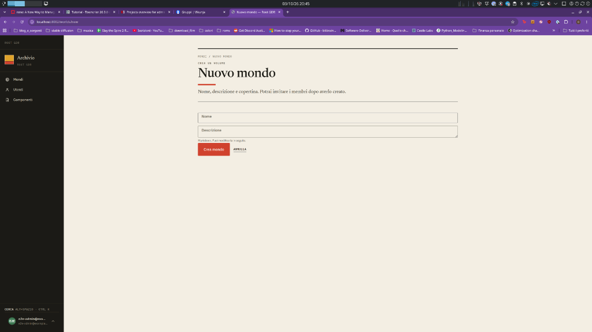
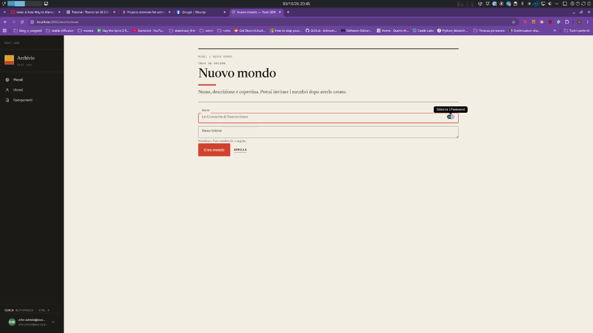
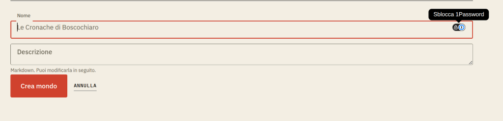

# Outlined field label alignment

## Approved cycle direction — 2026-10-03

Implement the shared Field correction in the approved infrastructure/document
cycle. Preserve the outlined/filled variants and diagnose the actual browser
rule/legend geometry before choosing an offset. Ticket: REQ-0002/T01.

## Visual references

Original screenshots from the user's 2026-10-03 report, stored in the repository:

[Interactive field proposal](../../prototypes/devin-prototype/feedback-2026-10-03/index.html?view=fields).
The prototype is a visual study, not the application fix.

## Report

In the world creation form, focusing `Nome` animates the label upward, but it
settles above the top border instead of inside its notch. The fields otherwise
look close to the intended design. Evidence: screenshots 1–3 from the
2026-10-03 feedback. Browser reproduction is still required.

## Requested outcome

- Keep the existing outlined-field treatment and restrained animation.
- Center the floating label vertically on the visible top rule; the notch must
  surround the label without cutting through its text.
- Apply the correction to the shared field, including textareas, rather than
  adding a world-form override.

## Investigation boundary

Start with `src/frontend/components/common/Field.css` and `Field.jinja`.
Check the actual fieldset/legend geometry and loaded styles before changing
label offsets. A label with `top: 0` is not proof that the visible rule is at
that coordinate. The password-manager overlay in the screenshot is external
browser UI and is not part of this request.

This refines the outlined anatomy in
[earlier field feedback](feedback-2026-09-21-round-2.md#9-fields-should-follow-the-intended-m3-anatomy);
it does not request another field redesign.

## Acceptance and verification

- Empty, focused, populated, autofilled, blurred, error and disabled states keep
  the correct label/notch placement for both input and textarea.
- Focus does not move the field, supporting text or neighboring controls.
- Long labels, browser zoom and reduced motion remain usable; labels retain
  their accessible association with the input.
- Add a browser component regression test for label/rule geometry. Capture
  desktop and phone screenshots and compare with `prototypes/devin-prototype/`.

Specification only; implementation is not approved by recording this request.
Ticket status belongs in Vikunja.
