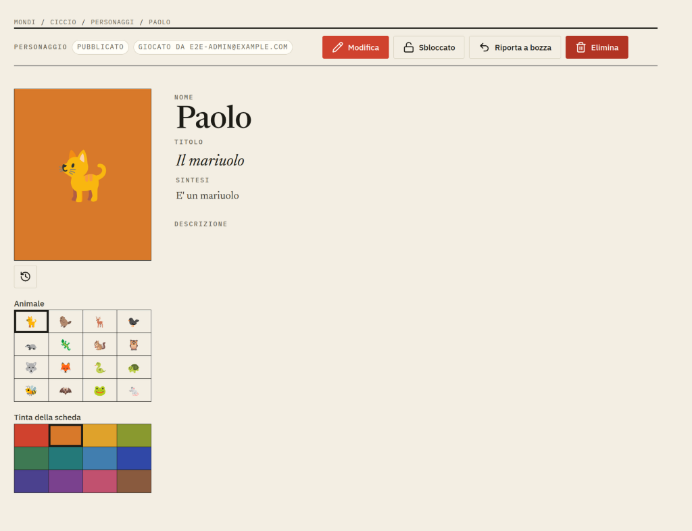

# Empty document body editing

## Visual references

[Character empty-state proposal](../../prototypes/devin-prototype/feedback-2026-10-03/index.html?view=character)
and [session recap proposal](../../prototypes/devin-prototype/feedback-2026-10-03/index.html?view=session).
These are visual/interaction studies with no backend persistence.

## Report

Name, title and summary have a clear editing interaction. The character's long
description does not appear to offer the same access; places seem to have no
description, and a new session's `Resoconto` cannot be written. Evidence:
screenshots 4 and 7, plus the user's place report. No place screenshot was
provided; reproduce that case separately.

## Source baseline

`editorial.DocEdit` already renders a body source, an editor host and a
focusable reading block. Its empty reading block has no explicit minimum
height or writing invitation. `mountDocEdit` in `src/frontend/js/editor/index.js`
opens it on double click, and `Modifica` delegates to this body editor.
An empty, hard-to-hit block is a plausible shared cause, not a confirmed browser
diagnosis. Check initialization, permissions and loaded assets as well.

## Requested outcome

- Every editable empty body offers a visible, usable writing target. Suggested
  Italian copy: `Aggiungi una descrizione…`, `Scrivi il resoconto…` or
  `Inizia a scrivere…`, according to the document type.
- Give it the same focus/active language as name, title and summary while
  preserving Markdown caret placement rather than selecting the entire body.
- Keep the existing document model: double click or Enter/F2 opens a focused
  block; `Modifica` also works when the body is empty; phone users have a clear
  single-tap edit command. Do not require a touch double click.
- Placeholder copy is UI only and must never be stored as document content.
- Preserve the character/place layouts that the user likes.

## Scope and acceptance

Cover characters, NPCs, places, session recaps, story text and static page text.
A focused blank block is reachable by Tab and arrow navigation, opens its
editor, accepts Markdown and mentions, autosaves and still contains the text
after a reload. Clearing it restores the empty writing target.

Locked documents and users without write permission remain read-only. Empty
reader views must not display an invitation to edit. Non-empty bodies retain
link navigation, editing and the established preview behavior.

## Verification

First reproduce the reported mouse/touch failure and add a failing regression.
Cover the shared empty state with frontend tests and representative E2E flows;
after editing, assert the persisted body through the API or database. Capture
desktop and phone screenshots against `prototypes/devin-prototype/`.

This is independent of the proposed
[story/page layout](REQ-0010-story-and-page-authoring-design.md): fixing access
to the body must not wait for a redesign. Specification only; status belongs in
Vikunja and implementation requires approval.
