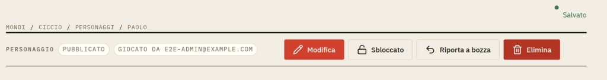

# Autosave indicator alignment

## Visual references

[Aligned indicator proposal](../../prototypes/devin-prototype/feedback-2026-10-03/index.html?view=character).
Edit a field to see the yellow state; the prototype simulates saving locally.
No original yellow-state screenshot was supplied.

## Report and source baseline

The green dot sits above `Salvato`; the yellow save state has the same problem.
Evidence: screenshot 5 and the user's report of the yellow state.

In `common/SaveIndicator.css`, the indicator spans the container's top padding
band, its text is bottom-aligned, and its pseudo-element uses
`align-self: center`. Those rules align the dot and text against different
vertical references. Verify their actual boxes in the browser before fixing.

## Requested outcome

- Dot and text form one compact, vertically aligned status unit in every state:
  dirty, saving, saved, error and conflict.
- Preserve one shared indicator per document, its unobtrusive placement and
  the existing autosave behavior.
- Do not make breadcrumbs, the document bar or content jump when the indicator
  appears, changes wording or disappears.

## Acceptance and verification

- The dot's center aligns with the text line's center at desktop and phone
  widths, including wrapped/long error wording and browser zoom.
- Green and yellow states are checked explicitly; errors remain legible and
  announced through the existing live status region.
- Add frontend geometry coverage for representative states. Capture desktop
  and phone screenshots and compare with `prototypes/devin-prototype/`.

No toolbar redesign is required for this fix. Specification only;
implementation requires approval and ticket status belongs in Vikunja.
