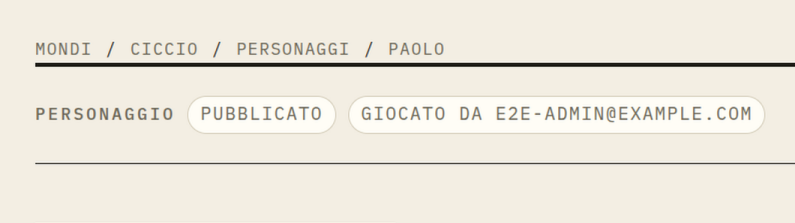

# Document toolbar and publication states

## Approved cycle defaults — 2026-10-03

Implement icon-only commands and a labelled secondary action menu as T01.
For T02, adopt compact rectangular editorial publication badges: paper/forest
for published and paper/ochre with readable ink for draft. These are the approved
AFK-cycle defaults, not a redesign of every common.Pill. Ownership stays in its
current place; document tint, publication and story progress remain distinct.
The earlier review questions below are resolved by these cycle defaults.

## Visual references





[Interactive toolbar study](../../prototypes/devin-prototype/feedback-2026-10-03/index.html?view=character).
Select `Icone` to inspect the chosen direction. Publication, locking and save
feedback are local simulations only.

## Confirmed decision — 2026-10-03

After reviewing the prototype, the user chose **icon-only document commands**.
This applies to the action bar, not to every control or label in the app.

- Use icons without visible button text for edit, lock/unlock, publication and
  the secondary-actions trigger.
- Keep publication state, ownership (`Giocato da`) and other facts as readable
  text. Keep `Giocato da` in its current location for now.
- Every icon command retains an Italian accessible label and tooltip. Labels
  and icons follow the current action: for example, `Pubblica` versus
  `Riporta a bozza`, and lock versus unlock.
- Preserve visible focus, stable geometry, at least 44px phone touch targets
  and the existing permission/confirmation behavior.
- The status colors and badge shape below still require review. Choosing icons
  does not approve all other details of the mock or an application implementation.

## Report and existing constraints

Character creation and the document identity fields are appreciated. The top
bar needs refinement; `Pubblicato` looks dull and `Bozza` needs a better color
treatment. Evidence: screenshots 4–7 and 10.

`editorial.Docbar` already separates facts and commands structurally. Refine
that hierarchy. Keep publication state, story progress, lock state and content
tint distinct. Content tint must not determine publication status color.
Do not change roles, publication semantics or confirmation flows.

## Alternatives reviewed

### A. Compact editorial bar — not selected

Icons plus text for edit, lock and publication, with danger actions in a
secondary menu. This was the agent's initial recommendation; the user preferred C.

### B. Two explicit rows — not selected

Facts above labelled commands, with destructive actions apart from ordinary
commands. More discoverable, but taller.

### C. Icon-only commands — selected

```text
PERSONAGGIO   Pubblicato   Giocato da …             [Edit] [Lock] [Publish] [More]
```

The bracketed names represent icons with Italian accessible labels/tooltips,
not literal UI copy. Keep less frequent commands understandable and do not
rely on hover-only explanations on phones. Destructive actions retain a
labelled secondary menu and their existing confirmation.

## Publication-state treatment to compare

- `Pubblicato`: warm paper with a restrained forest-green marker and readable
  ink; avoid a pale, disabled-looking label.
- `Bozza`: ochre accent with readable dark text, visually distinct from
  published without suggesting an error.
- Compare compact rectangular badges with the current pills. Badge shape and
  exact token choices remain proposals, not accepted changes to every Pill.
- Always retain state text; color alone cannot communicate visibility.

## Acceptance and verification

Review draft/published and locked/unlocked combinations across document types,
including long ownership labels, current-place state and story progress.
Read-only users see facts but no unauthorized commands. Icon commands remain
keyboard reachable and labelled; danger commands retain confirmations.

Verify the selected toolbar on real character, session and story content at
desktop and phone sizes against `prototypes/devin-prototype/`. Get the user's
choice for the remaining status treatment. Implement toolbar and status changes
as separate small tickets with frontend/E2E coverage.

Related: [save alignment](REQ-0004-save-indicator-alignment.md) is a separate bug;
[action shortcuts](REQ-0006-document-action-shortcuts.md) invoke the same commands.
Specification only; ticket status belongs in Vikunja.
