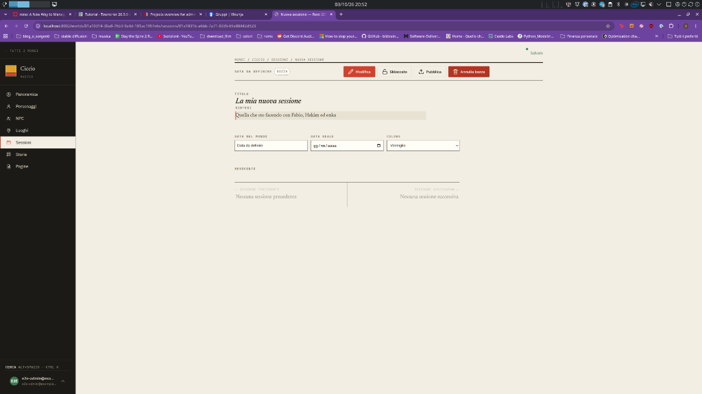
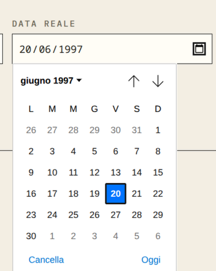

# Session real date and calendar

## Visual references

[Interactive session/date proposal](../../prototypes/devin-prototype/feedback-2026-10-03/index.html?view=session).
The desktop calendar demonstrates the atlas treatment; the phone keeps a
native date input. This study does not implement the full accessible calendar
contract or persist dates to the backend.

## Report and baseline

A new session has an empty `Data reale`; it should start at today. Its calendar
popup looks unrelated to the application. Evidence: screenshots 7–8.

`session_new_submit` in `src/backend/sessions/views.py` creates a draft without
passing `real_date`. `editorial.Metadata` renders a native `input type="date"`.
The popup belongs to the browser/OS; application CSS cannot reliably restyle
that native calendar across browsers.

## T01 — Default interactive session creation to today

- Persist today's calendar date when creating a session through the application;
  do not merely show an unsaved placeholder or fill the field on every render.
- Keep the date editable, including creating an older session and clearing the
  date if the existing nullable contract permits it.
- Do not overwrite existing sessions, explicit API dates or imported dates.
  Preserve the distinction between `Data reale` and `Data nel mondo`.
- Define what timezone determines today before implementation. The recommended
  product behavior is the creating user's local calendar date, not an implicit
  UTC/server date. No stored timezone preference is authorized by this request.

Acceptance: a newly created draft already contains the chosen date in persisted
state; reload preserves it, and historical/manual dates remain unchanged. Test
midnight/timezone boundaries and ensure session ordering/neighbors still work.
This small behavior change can be delivered before choosing a new calendar.

## T02 — Choose a calendar interaction

Compare these options rather than attempting to skin the native popup:

| Alternative | Benefit | Cost/limit |
|---|---|---|
| Styled date field, native picker everywhere | Smallest implementation; established mobile behavior | Popup remains browser-themed |
| Atlas calendar on desktop, native picker on phone | Consistent desktop popup without losing the phone picker | Two presentations to verify |
| Atlas calendar everywhere | Consistent visuals | Full keyboard, focus, localization and touch calendar behavior to maintain |

Recommendation for review: the hybrid option, if the native desktop popup is
unacceptable. A custom calendar should use paper/ink surfaces, restrained rules,
a clear selected day, `Oggi`, month/year navigation and Italian date copy.
Use an accessible existing dependency only after checking project dependencies;
adding a library is not a settled choice.

Acceptance for a custom picker: typed dates and calendar selection agree;
opening, arrow navigation, month changes, selection, Escape and focus return
work; clear/today actions persist correctly; invalid dates are explained near
the field. Cover locked/read-only states and leap days.

## Verification

T01 needs integration/E2E persisted-date assertions. T02 needs browser interaction
coverage in supported browsers. Capture desktop and phone screenshots and
compare with `prototypes/devin-prototype/` for each delivered ticket.

Specification only; calendar choice and implementation need approval. Ticket
status belongs in Vikunja.
