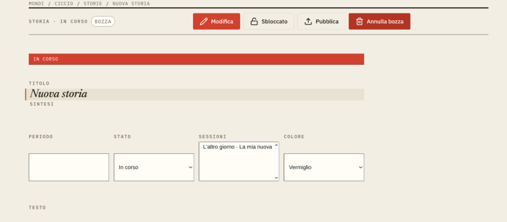

# Document tint picker

## Visual references

[Interactive swatch-palette proposal](../../prototypes/devin-prototype/feedback-2026-10-03/index.html?view=session).
The selected tint updates the local preview only; API persistence remains work
for the implementation agent.

## Report and baseline

The `Colore` dropdown showing `Vermiglio` does not fit the document's visual
language and does not preview the color being selected. Evidence: screenshots
7 and 10. The user has not selected a replacement interaction.

Sessions, stories and pages currently expose `tint` as a native select through
`editorial.Metadata`. Characters and places already have a visual tint grid in
`editorial.ImageEditor`. Keep the existing twelve-token palette and storage
contract; free-form colors are not requested.

## Alternatives to review

1. **Inline swatch grid:** all twelve tints are visible; selection is immediate.
   Familiar from character creation, but takes more space beside metadata.
2. **Compact swatch + name trigger, opening a palette:** `Colore: [swatch]
   Vermiglio`; activate it to choose from a rectangular grid. Recommended for
   document metadata because it is compact without hiding the actual color.
3. **Swatch-and-name list:** useful when names matter more than scanning the
   palette; longer and less direct than the grid. A custom list needs proper
   keyboard and focus behavior, not a decorated native option popup.

Exact presentation needs desktop/phone review. Reuse `ChoiceGrid`, existing
selection semantics and palette tokens where appropriate; do not mount the
entire image editor on image-less documents.

## Acceptance

- Current and proposed tints have visible swatches and Italian accessible names.
  Selection is identified by a stable border/mark as well as color.
- The control supports keyboard, visible focus, phone touch targets and
  locked/read-only states. A popup closes with Escape and restores focus.
- Selection updates the current document's visible tint-dependent surfaces
  immediately and persists through the existing versioned autosave API.
- Save failures/conflicts retain recoverable state and do not show a false
  success. Reload confirms the selected token; no palette values are renamed.
- Content tint remains separate from draft/publication and autosave colors.

## Verification and boundaries

Component tests cover selection, names and popup behavior. E2E checks cover
session/story/page persistence through API/database assertions. Compare desktop
and phone screenshots against `prototypes/devin-prototype/`.

Coordinate placement with
[story/page authoring](REQ-0010-story-and-page-authoring-design.md). This request
does not redesign every select in the app. Specification only; implementation
requires approval and ticket status belongs in Vikunja.
