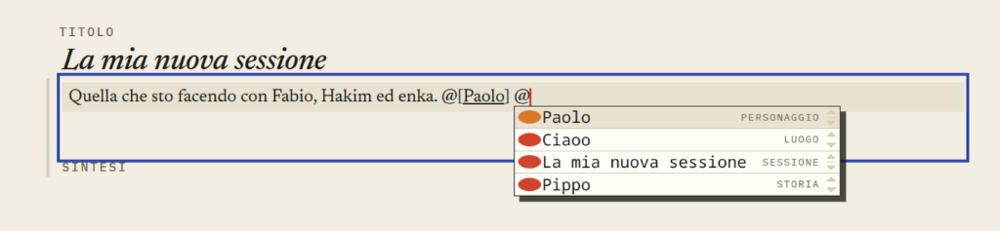

# Mention suggestion identity

## Approved cycle defaults — 2026-10-03

T01 extends the typed suggestion payload with existing animal/shape identity
and applies the document services' world/draft/reader visibility before output.
T02 uses rich rectangular marks in the existing CodeMirror completion menu,
with content-kind fallback, safe text/SVG handling and unchanged insertion
syntax. No uploaded thumbnails, race taxonomy or inline-mention redesign.

## Visual references

[Interactive mention-menu proposal](../../prototypes/devin-prototype/feedback-2026-10-03/index.html?view=mentions).
Suggestions are hardcoded; this is not a permission-filtered resolver or a
replacement for CodeMirror. Compare color-only and richer identity marks.

## Report and source baseline

The `@` suggestion menu uses colored oval markers that look out of place.
The user proposes rectangles and, where available, the referenced character's
animal/race mark and tint. Evidence: screenshot 9. This report concerns the
suggestion menu, not another redesign of inline mention links.

`editorial/Reference.css` gives CodeMirror completion icons a circular radius.
`MentionSuggestion` in `src/backend/content/actions.py` currently carries name,
kind, tint and insertion text, but no animal or place shape. Richer identity
marks need an explicit typed payload extension, not a client-side guess.

## Proposed direction — details to review

- Use a stable square/rectangular mark cell instead of an oval dot. Verify
  actual icon geometry and inherited CodeMirror styles before changing it.
- Characters and NPCs show their existing animal mark on their tint; places can
  use their existing shape. Sessions, stories and pages get a restrained tinted
  rectangular fallback with a recognizable content-kind cue.
- In this request, the user's word "race" refers to the existing visual animal
  identity; a new race taxonomy or domain field is not requested.
- Keep name and Italian content-kind text visible. Names, tint and shape must
  not be the only means of distinguishing identical names.
- Compare the rectangular color-only option with the richer mark option before
  choosing. Uploaded-image thumbnails are outside the initial scope.

## Acceptance

Long names truncate/read clearly without stretching the identity cell. Active
selection, hover and focus remain legible; Up/Down, Enter and Escape preserve
CodeMirror autocomplete behavior and caret position. Empty results and missing
visual metadata use a consistent fallback.

Suggestions still respect world, draft and reader permissions; enriching the
payload must not disclose inaccessible entities. Selected mentions retain the
existing unambiguous insertion syntax and server-side resolution. The menu
fits narrow screens without clipping off-screen.

## Verification

Frontend tests cover menu geometry, selection and keyboard behavior; integration
checks cover any payload extension and permission filtering. Verify inserted
Markdown through the API/database after autosave, not only in the DOM. Capture
desktop and phone screenshots against `prototypes/devin-prototype/`.

Specification only; implementation requires approval and ticket status belongs
in Vikunja.
