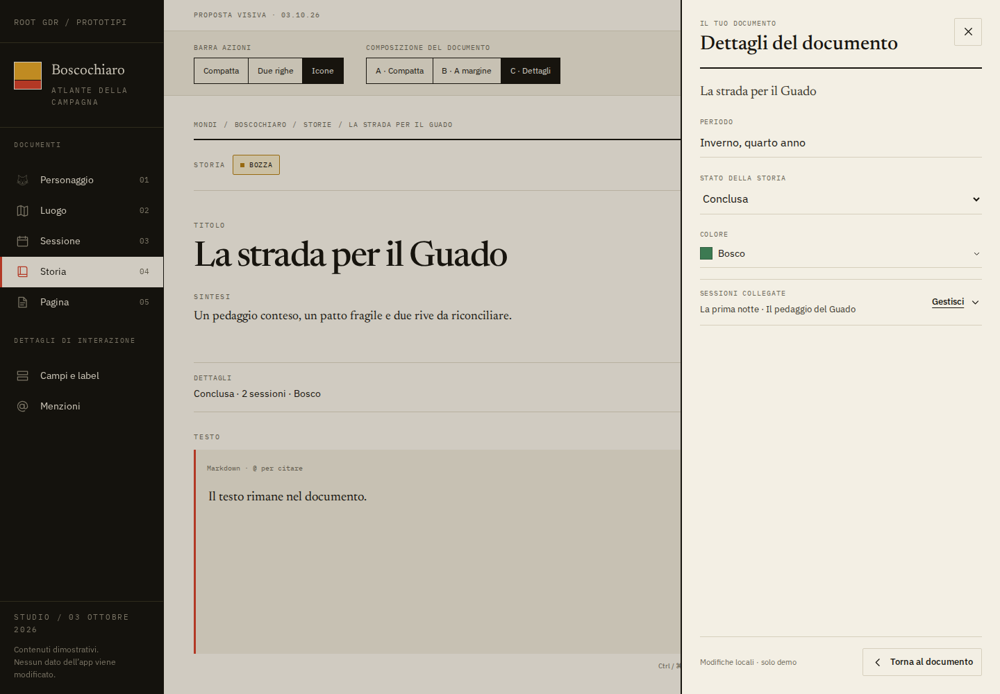
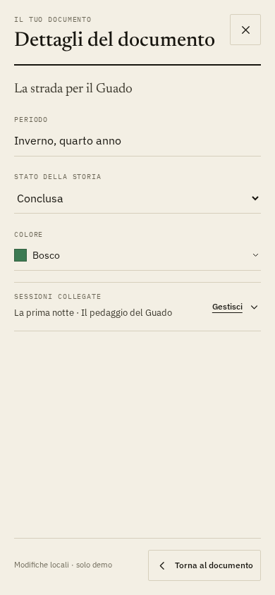

# Story and page authoring design

## Visual references and implementation-agent handoff


Selected prototype direction, with local demonstration edits:




Interactive studies:

- [Selected story direction — separate details](../../prototypes/devin-prototype/feedback-2026-10-03/index.html?view=story&layout=c)
- [Selected page direction — separate details](../../prototypes/devin-prototype/feedback-2026-10-03/index.html?view=page&layout=c)
- [Earlier A — compact inline metadata](../../prototypes/devin-prototype/feedback-2026-10-03/index.html?view=story&layout=a)
- [Earlier B — details in the margin](../../prototypes/devin-prototype/feedback-2026-10-03/index.html?view=story&layout=b)

Run from the repository root:

```bash
uv run harness prototype serve --port 4175
```

Then open `http://127.0.0.1:4175/feedback-2026-10-03/index.html?view=story`.
The original prototype files remain unchanged. The study uses their visual
tokens and locally served project fonts. It has fake content and memory-only
state: save, publication, lock, sessions and dates are demonstrations, not real
application operations. Reload resets the study. Its native textarea is not a
replacement for CodeMirror, and calendar behavior is not production-complete.

Use it as a visual reference; implement with the existing JinjaX components,
htmx, CodeMirror and typed services. Do not copy its mock state or client-side
rendering architecture into the application. Icon-only commands and separate
details are selected below; remaining control styling belongs to the related
requests. Original screenshots are stored once under
`assets/feedback-2026-10-03/` and embedded in each relevant request; no ticket
relies on `/tmp` or the chat attachment service. No place/page screenshots were
supplied in the original report.

## Report and baseline

Story creation feels like an unfinished form: loose spacing, a dominant status
band, boxed metadata and a native sessions multiselect. Pages have the same
reported problem. Evidence: screenshot 10 for stories; pages need their own
application capture.

Creation already opens a private draft on its ordinary document page, as
specified in [draft-first content](../features-implemented/draft-first-content.md).
Keep that flow, autosave and in-place writing. The earlier full Form/Preview
mode was rejected in [frontend decisions](frontend.md#two-layouts). Character
and place creation are liked and are outside this composition redesign.

## Confirmed direction — 2026-10-03

The user selected a compact details summary in the document, opening a separate
metadata surface: a side panel on desktop and a full-screen panel on a phone.
This refines C; details no longer expand into the writing column. The document
keeps its title, summary, body and normal in-place editing. There is no new
page route, separate whole-document edit mode or return to the rejected Form
mode. The icon-only toolbar is confirmed in
[REQ-0005](REQ-0005-document-toolbar-and-status-design.md).

- Stories summarize progress, linked-session count and tint. Pages summarize
  useful menu/address metadata and tint. Use a labelled `Dettagli` trigger.
- The panel contains period, story progress, linked sessions and tint for a
  story; address/slug, menu position and tint for a page.
- Keep existing autosave; closing returns to the document without an explicit
  Save step, loss of pending edits or accidental publication.
- Close via a visible command or Escape and restore focus to the details
  trigger. Modal focus stays in the panel; closing a picker must not dismiss
  its parent panel or discard local edits.
- Update the document's summary after metadata changes. Locked/read-only users
  may inspect permitted facts without gaining write controls.
- Preserve body edits and the editor position when opening/closing details.
  Surface metadata validation and save conflicts in the panel; verify actual
  persistence through the API/database during application implementation.

The prototype demonstrates the selected direction, not production persistence
or complete editor behavior. Other calendar, tint and state styling decisions
remain scoped to their own requests. Reuse `common.Dialog` and the existing
metadata/service layer rather than adding a second editing architecture.

## Alternatives reviewed

### A. Writing first, compact inline metadata — not selected

One writing column with visible period, progress, tint and linked sessions.
This was the initial recommendation. It remains in the prototype for comparison.
For pages, the row contains address, menu position and tint.

### B. Document with a metadata margin — not selected

A narrow details column beside the text. It must account for existing backlinks
and move details into a labelled section on a phone. The prototype retains it
for comparison; it is not the implementation direction.

### C. Compact summary opening separate details — selected

```text
DOCUMENT                               DETAILS PANEL
Title and summary                      Period / address
                                       Progress / menu position
[Dettagli: In corso · 2 sessioni]  ->    Tint
                                       Linked sessions (stories)
Text…                                  [Torna al documento]
```

The original C expanded metadata inline. After review, the user preferred a
separate details surface. On desktop the document stays visible behind the
panel; on a phone the panel occupies the screen. Title, summary and body remain
primary. The trigger retains a readable summary rather than hiding every fact.

## Shared design questions

- Review whether the story progress band adds enough beyond the details summary;
  reduce duplication only within this selected composition. Story progress
  remains distinct from `Bozza`/`Pubblicato`.
- Use a readable selected-session summary and an accessible selection surface.
  Do not assume the existing Combobox supports multiple selection. Keep
  parent-panel edits when managing session relationships.
- Optional metadata never blocks starting the body. No new mandatory fields,
  content templates, creation wizard or manual save mode are requested.
- Share composition principles between stories and pages while keeping their
  own fields. Do not roll this layout out to unrelated documents automatically.

## Small implementation-ticket boundaries

1. Validate the selected summary/panel composition on desktop and phone,
   including populated/empty bodies, focus return and existing backlinks.
2. Implement the story panel and session selection; verify persisted metadata,
   relationships and body, including save conflicts and locked/read-only views.
3. Apply the selected composition to pages; verify slug validation, canonical
   URL updates, menu position and retained body/editor state.

Each implementation ticket needs passing tests, API/database save assertions,
desktop/phone screenshots and an update to the existing feature manual. Board
status belongs in Vikunja. This is a design decision and implementation
specification; application changes will be handled by the implementation agent.

## Related requests from the same feedback

- [REQ-0002 — Field label alignment](REQ-0002-outlined-field-label-alignment.md)
- [REQ-0003 — Empty descriptions and recaps](REQ-0003-empty-document-body-editing.md)
- [REQ-0004 — Autosave indicator alignment](REQ-0004-save-indicator-alignment.md)
- [REQ-0005 — Toolbar and publication states](REQ-0005-document-toolbar-and-status-design.md)
- [REQ-0006 — Document action shortcuts](REQ-0006-document-action-shortcuts.md)
- [REQ-0007 — Session date and calendar](REQ-0007-session-real-date-and-calendar.md)
- [REQ-0008 — Tint picker](REQ-0008-document-tint-picker.md)
- [REQ-0009 — Mention suggestion identity](REQ-0009-mention-suggestion-identity.md)
