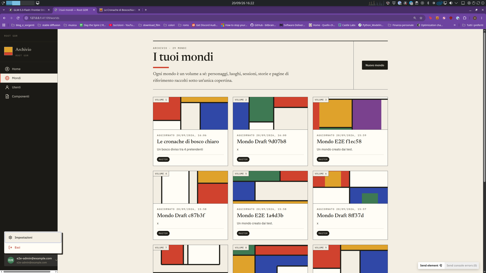
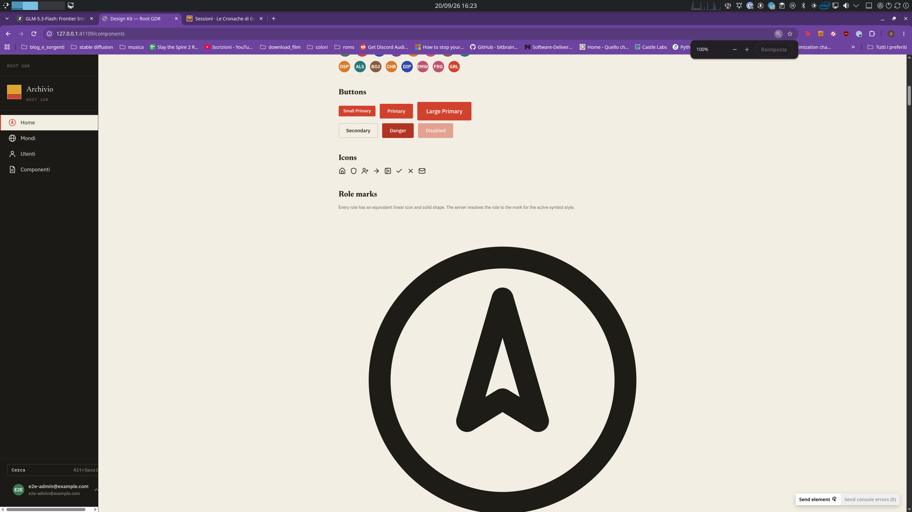
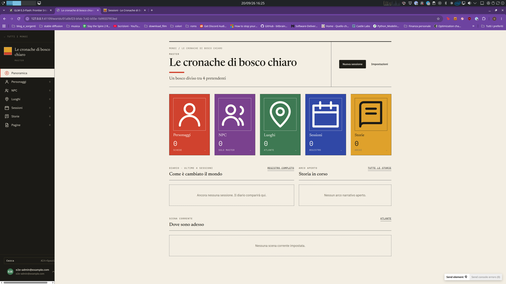
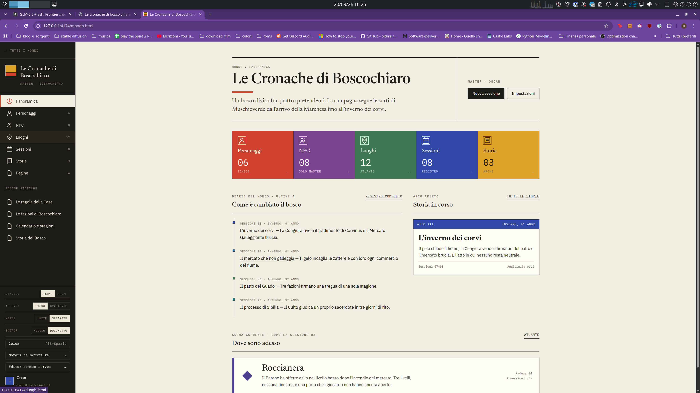
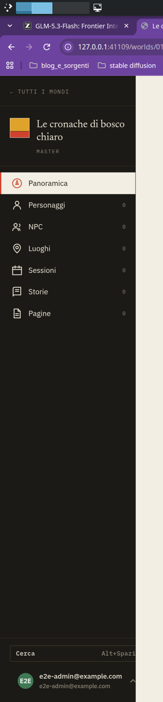
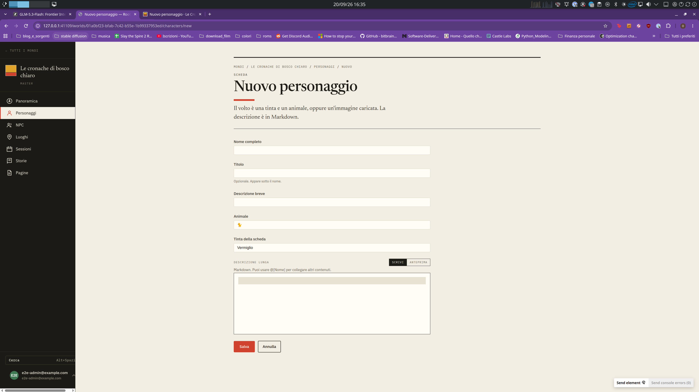
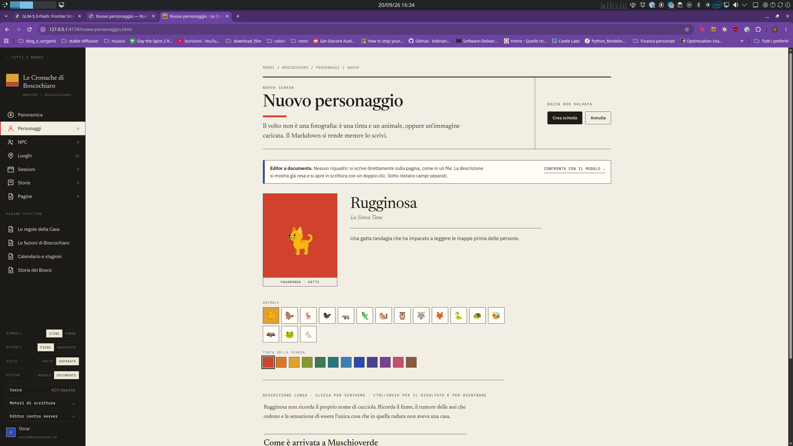
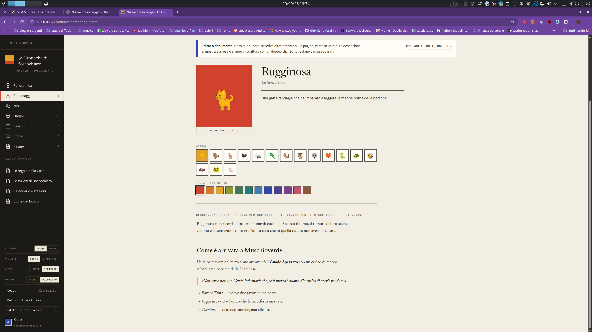

Sources di riferimento
docs/features-request/desired_features.md
docs/features-request/frontend.md
docs/features-request/starting_description.md
docs/features-request/high_level_starting_description.md
prototypes/devin-prototype

Il tasto impostazioni non ha un bordo

http://127.0.0.1:41109/worlds/01a0bf23-bfab-7c42-b55e-1b99337953ed/personaggi dà 404.
Ok in playwright devi creare dei test atomici, che dimostrano che il singolo bottone funziona, e poi dei casi d'uso più complessi, come quelli che farebbe un utente, ad esempio:
- crea il mondo
- clicca dalla panoramica ai personaggi e crea un personaggio
- torna alla panoramica
- clicca sugli NPC e crea un NPC
- torna alla panoramica, ripeti per le cose mancanti.
Piano piano controlli anche che le diverse parti della panoramica si sono aggiornate

Creazione di un mondo di default che posso guardare un po' per controllare le featuere post creazione al posto di creare: il boschetto di smeraldo, con 4 giocatori, un gatto, una volte, un topo e un tasso. 3 NPC, scegli un po' te, un paio di radure
Inventati anche 3 sessioni passate, con magari del markdown un po' diverso l'uno dall'altro e delle pagine.

Menu delle impostazioni è bianco nonostante il rail sia nero. questo è un problema che vedo su un sacco di repo che faccio a partire dal template, riusciamo a trovare una soluzione migliore?

I componenti hanno dei role marks davvero giganti, non il massimo. Inoltre per qualche motivo nella rails non è selezionato la voce del componente, non il massimo.

Differenze con il prtotipo originale. nel prototipo le cards con Personaggi, NPC, Luoghi etc sono tutte attaccate e dei rettangoli più lunghi che alti. Del prototipo non mi piace il bordo all'icona che toglierei.
Nella implementazione invece le card sono più alte che lunghe, hanno ste icone giganti, non sono attaccate.

Probabilmente c'è un elemento nel rail troppo largo. ho una scrollbar orizzontale che ovviamente non vorrei, e Cerca alt+spazio sborda oltre il bord della rail, scomparendo. forse l'email è troppo lunga? eviterei visto che è proprio brutto

> 404 su Personaggi/NPC — world_nav e le quick card derivavano l'URL dall'id di sezione (/personaggi, /npc) ma le route sono /characters e /npcs. Ora ogni sezione porta il suo path esplicito. Verificato dal vivo: i vecchi URL 404, quelli veri 200, e il crawl Playwright segue ogni link della rail e delle quick card asserendo 200.
Ok riuciamo a fare un pre-commit hook che controlla che non ci siano link stale?

Come puoi ben vedere, sono molto diversi. Del prototipo mi piaceva
Se hai fatto una ricompattazione del contesto, vai a rileggerti i documenit con le descrizioni delle features, visto che questo te lo avevo già detto. Magari aggiungiamo questa regla di riaprire le specifiche in AGENTS.md dopo ogni ricompattazione.
Le modifiche a editor usano appunto un editor markdown (guarda nelle specifiche quali) e mi permettono di avere un'esperienza di modifica molto più naturale.
Inoltre al posto di aver un dropdown ho una lista di icone di animali, e al posto di avere un dropdown dei colori ho una lista di colori.
Li organizzerei magari in due griglie adiacenti così sono organizzati un po' meglio e lo spazio è un po' meglio.

Regarding the retrospective:
> Chiarimenti che mi avrebbero evitato errori: la regola URL italiano/inglese (il 404 di Personaggi/NPC nasce solo da lì: ho indovinato invece di confrontare col registro delle route); se il prototipo è il contratto di markup e classi o solo un riferimento; un definition of done per ticket che includa uno screenshot di confronto.
- Se possibvile, ti darò gli screenshot così puoi fare il paragone. riguardo la lingua, scriviamo nell'agent.md che tutto il sorgente deve essere in inglese, anceh endpoints. La lingua della UI è in italiano perchè io sono in italiano.

Aggiungiamo in Agents.md il fatto di rileggere tutte le source dopo una ricompattazione.

> Ciclo con reload — il mio era modifica → restart container (6 s) → screenshot; --reload nel harness di test lo porta sotto il secondo.
Importantissimo, abbassiamo al minimo i tempi di iterazione se no non finiamo più-
