icone e forme 1) hanno quel bordo molto bruttarello, 2) visto che sono mutualmente eslcusivi, farei dei common compoents (ti riporto la spec m3)
1) button group, perche li posso cliccare entrambi
2)
Caratteristiche di un button group:
Standard button group
Connected button group

Configurations for both variants of button groups:
Extra small
Small
Medium
Large
Extra large
Single-select and multi-select
Round and square

<table class="borderGGrey400" style="width:100%"><thead><tr><th>
Category
</th><th>
Configuration
</th><th>
M3
</th><th>
M3 Expressive
</th></tr></thead><tbody><tr><td>
Size
</td><td>
XS, S, M, L, XL
</td><td>
--
</td><td>
Available
</td></tr><tr><td>
Default shape
</td><td>
Round, square
</td><td>
--
</td><td>
Available
</td></tr><tr><td>
Selection
</td><td>
Single-select, multi-select, selection-required
</td><td>
Available as&nbsp;
    
    segmented button
    
      Segmented buttons help people select options, switch views, or sort elements. Note: They're deprecated in the expressive update. Use a nav rail instead.
    
      
            <a class="tooltip-link-content " tabindex="0" rel="noopener noreferrer" target="_blank" href="/m3/pages/segmented-buttons/overview">More on segmented buttons</a>
          
   
</td><td>
Available
</td></tr></tbody></table>

il sito ha anche una token spec che dice quanto una roba deve essere grande o piccola.
Ed esempio, extra small:
- Button group xsmall container heigh: 32dp
- Button group xsmall between space: 18dp
- Button group xsmall pressed motion spring dampening: 0,9
- Button group xsmall pressed motion spring stiffness: 1400
- Button group xsmall pressed width multiplier: 15%
prima di iniziare a implementare, vedi se riesci a scaricarti la spec con tutti i valori esatti cercando online, magari c'è un makrdown o una repo o robe del genere, la controllo e poi ti do l'ok
Button groups are invisible containers that add padding between buttons and modify button shape. They don’t contain any buttons by default.

link
Copy link
Common layouts
Mix and match buttons and icon buttons for different scenarios:
Label buttons
Label buttons and icon buttons
Extra small icon buttons
Large icon buttons

Color
Button groups have no color properties. They can use the default button or toggle button color styles, like filled, tonal, and outlined. Avoid using standard icon buttons or text buttons, as they have no container treatment.

link
Copy link
Standard button groups add interaction between adjacent buttons when a button is selected or activated.

This interaction changes the width, shape, and padding of the selected or activated button, which adjusts the width of buttons directly next to it.
Copy link
Connected button groups don’t add any interaction between buttons when selected or activated.

They only affect the shape of the button being selected or activated.

pause
A selected button changes shape without affecting adjacent buttons

link
Copy link
States
link
Copy link
Standard button group
link
Copy link
When a button is pressed, standard button groups modify the width and shape of that button and adjacent buttons.

5 states of a standard button group.
Enabled
Disabled
Hovered
Focused
Pressed
link
Copy link
When a toggle button is selected in a standard button group, its shape should change between square and round. The color should change according to the button specs.

5 states of a standard button group with toggle buttons.
Enabled
Disabled
Hovered
Focused
Pressed

link
Copy link
Connected button group
link
Copy link
For all connected button groups, use 2dp padding. This provides visual consistency at scale.

spec intera qua, se necessario guardati pure le immagini:
https://m3.material.io/components/button-groups/specs

in ogni caso:
https://m3.material.io/components/segmented-buttons/overview
le impotazioni sono segmented buttons
Segmented buttons can contain icons, label text, or both

Two variants: single-select and multi-select

Use for simple choices between two to five items (for more items or complex choices, use chips)
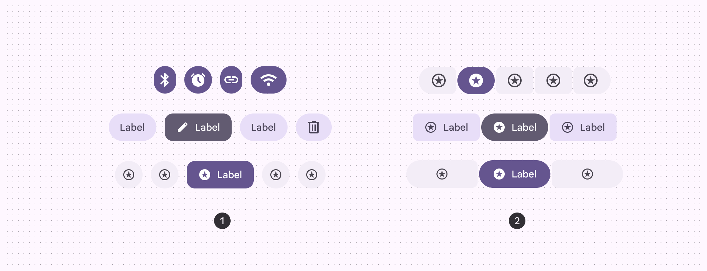
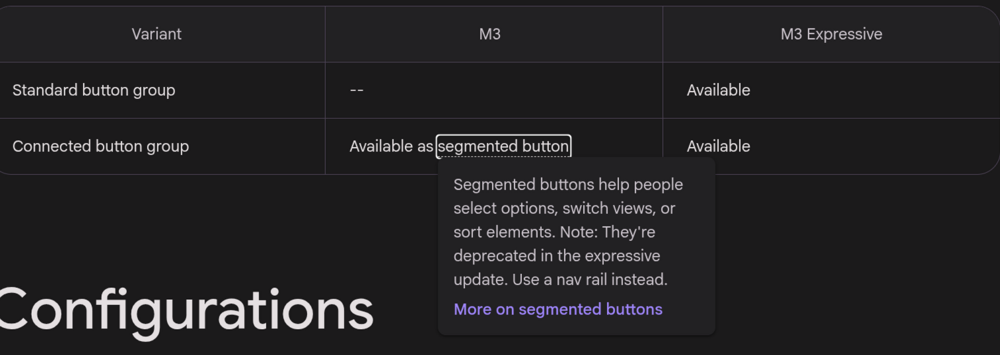
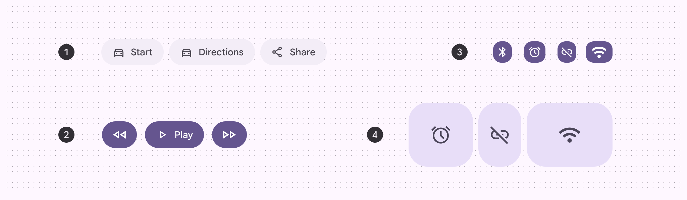
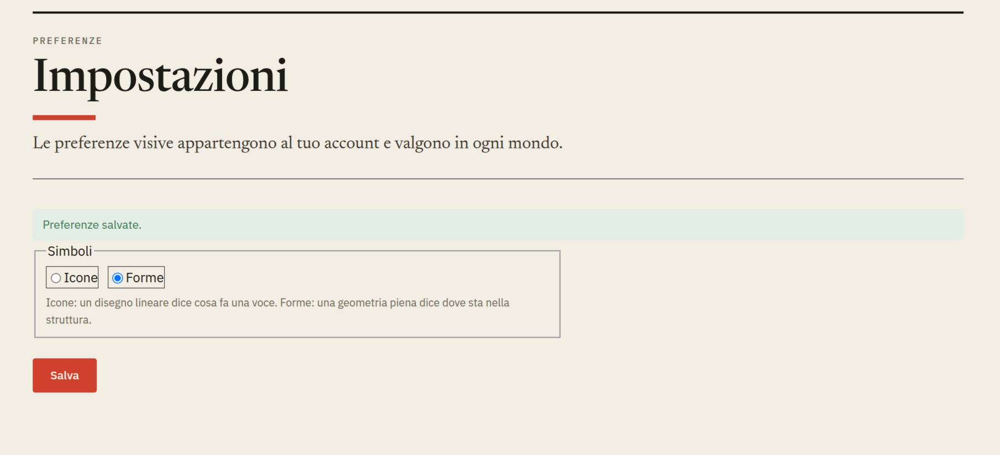

Per qualche motivo, componenti non è ancora selezionatoquando ci clicco
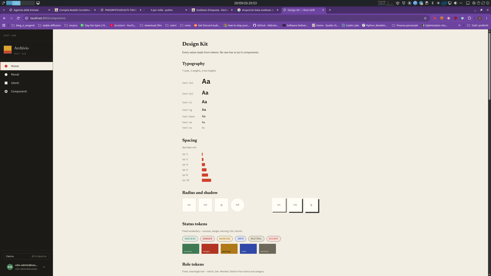

ok ora, sezione panoramica:
ho cliccato sul bottone delle impostazioni:
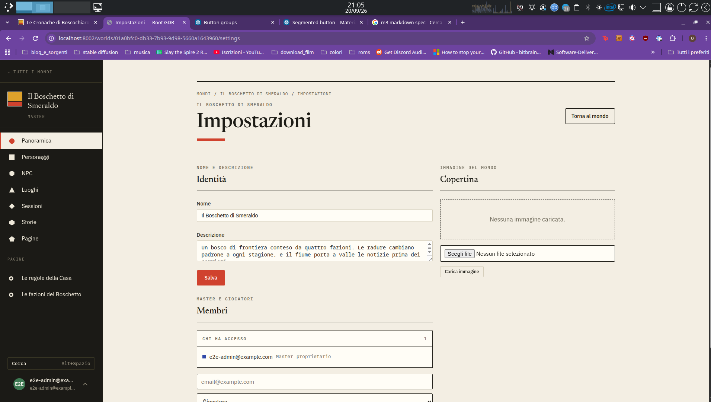
Allora, ci arriveremo dopo, ma in generale l'implementazione dell'editor non è stata un granchè.
innanzittuo il coso per caricare un'immagine con scritto "scegli file" non mi piace proprio. Piuttosto, l'immagine di copeartina ha un al centro che mi permette di caricarne una o modificare quella attuale. anche drag and drop di una immagine deve funzionare. teniamo traccia dello storico delle copertine. togliamo quindi il bottone carica immagine.
In generale la parte con l'editor markdown deve essere così:
tutto il testo è in markdon, e se ci clicco sopra e quel testo è modificabile, allora si attiva l'editor (ma a livello di renderizzazione è praticamente identico) e lo cambio. le text area non sono una buona soluzione, bisogna stretcharle, non renderizzano il markdown, etc. Non mi piace il bottone salva in generale, gradirei che salvasse implicitamente. se la text area è grande, ovviamente non bisogna salvarla ad ogni nuovo carattere aggiunto o tolto. se questo rewnde più semplice i salvataggi, comunque starei attento che se chiudo il browser o cambio pagina, tutto quelo non salvato viene salvato. magari i cambiamenti possono essere slavati momanteanemente nel browser e salvati in un secondo momento?
L'immagine 15 secondo me rende molto esplicito il problema di questa implementazione, c'è sempre una text area, più una roba separata che controlla qualcos'alro e poi un bottone aggiungi. vorrei che l'esperienza utente fosse più imile a come abbiamo detto per la copertina: al posto di avere l'immagine soloin lwrruea, scegli file e il bottone carica immagine, c'è già l'immagine che è un elemento con funzionalità.
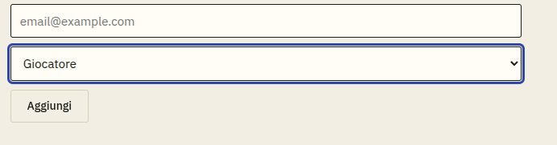

Anche nuova sessione, ci sta il testo, a se fosse un'icona? e le impostazioni fossero un'icona?

toglierei il bordo alle forme geometriche, non mi piacciono tanto
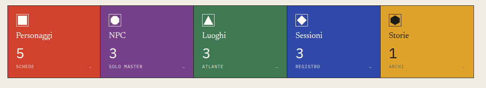

ok ora personaggi
nuovo personaggio, stessa cosa di prima, di per se non è male, vorrei un bottone con un piu', non saprei bene però come organizzarlo.
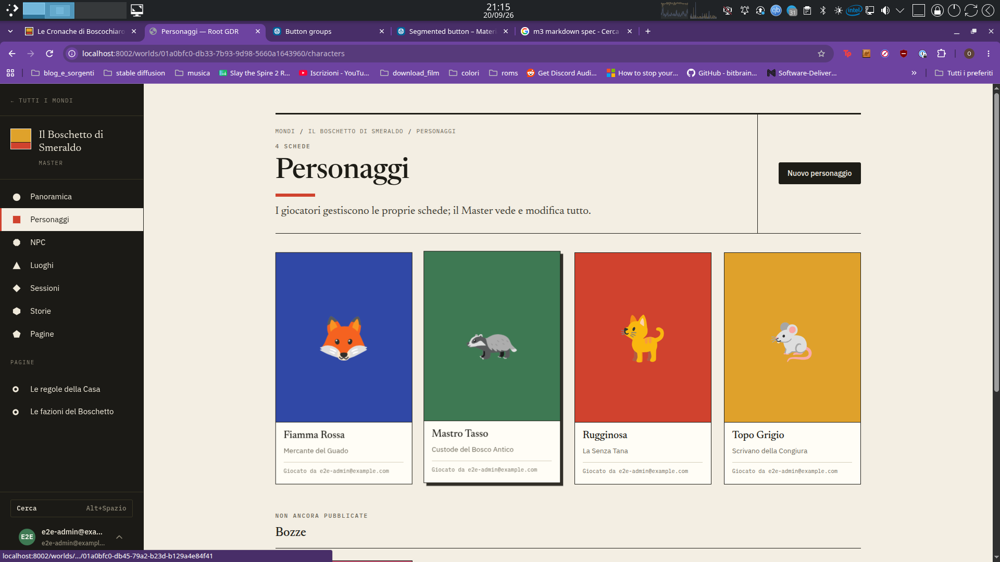
ok ho cliccato su fiamma rossa. Ok in realtà probabilmente lo hai fatto bene il documento.
Per il noem e il titolo, mi piace che c'è il borto attorno, fa capire che lo sto modificando. 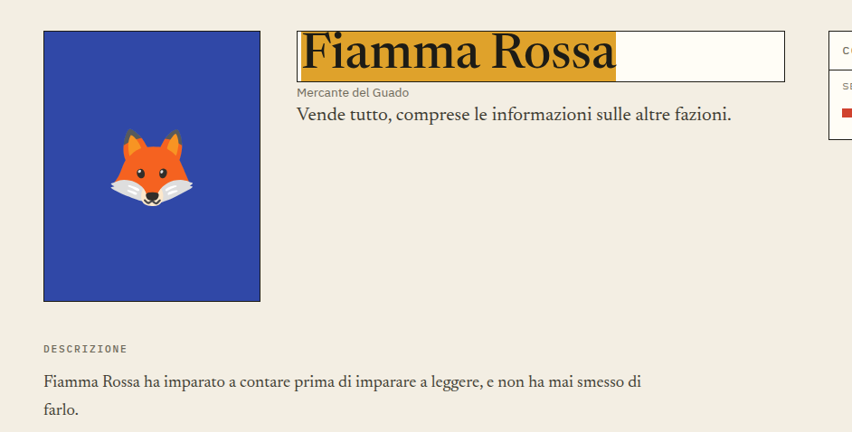.
Nel prototipo era così 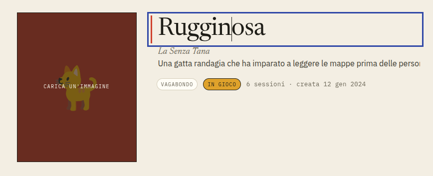, mi sembra molto simile.
Il titolo, però è un po' troppo piccolo, lo metterei anche in conrsivo. azz mi sembrano delle text areas queste. vabbè in realtà va bene così per nome e titolo.
Riguardo la descrizione lunga e la descrizione corta, invece, descrizione corta dovrebbe essere con l'editor e accettare markdown.
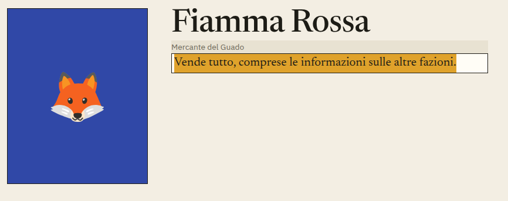

Allora odio il salva. ovviamente deve essere salvato, vorrei qualcosa di un po' più automatico, ctrl+invio lo chiude e salva. se è aperto e si cambia pagina o robe del genere, bisogna comunque salvarlo, immagino che deve salvare il testo / la salva localmente così almeno pulò fare una richiesta. farei una richiesta di salvataggio ogni tot / ogni tot caratteri per essere sicuri.
Noto che se clicco @, non c'è il menu fuzzi che mi permette di citare personaggi, luoghi o storie.
Come per prima, se clicco sulla immagine vorrei fare due cose diverse:
1. caricare un'immagine
2. cambiare emoji / colore
I collegamenti mi piacciono, teniamoli così
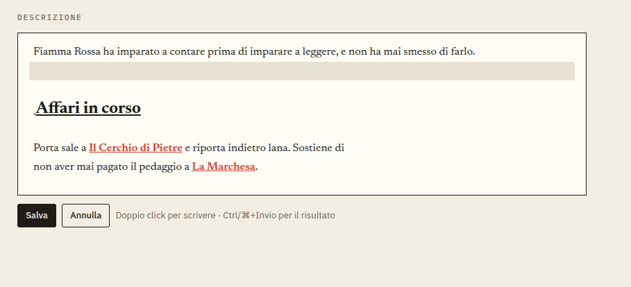
stesse identiche considerazioni per gli NPC
stesse cose per i luoghi

le sessioni mi piacerebbe magari un + che clicco e me ne fa creare una nuova.

## create un nuovo personaggio
dal prototipo era http://127.0.0.1:4174/nuovo-personaggio.html
se guardi il prototipo, il nuovo personaggio ha caratteristiche simili al perosnaggio in se.
al posto di avere delle text area che sembrano di un form, sembra del testo che puoi modificare. molto più fico
Animate e tinta della scheda devono essere della stessa altezza.
Sulla desacrizione lunga |scrivi|antepima|, non ci siamo proprio, è esattamente l'opposto di querllo che voglio.
Alla la creazione dovrebbe avere:
Una prima parte con l'immagine, se ci fai sopra compare scritto "carica immagine", qua darei anche la possibilità di cambiare animale o sfondo, non saprei come farlo, se con un toggle.
nel prototipo la descrizione lunga quando è selezionato ha un colore accent sul lato che mi piace molto
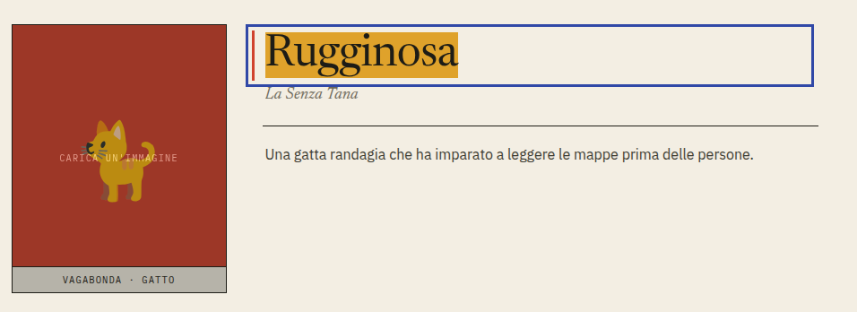
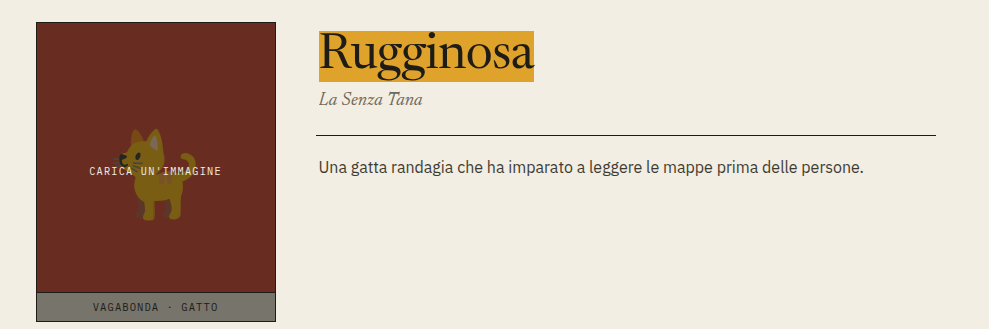
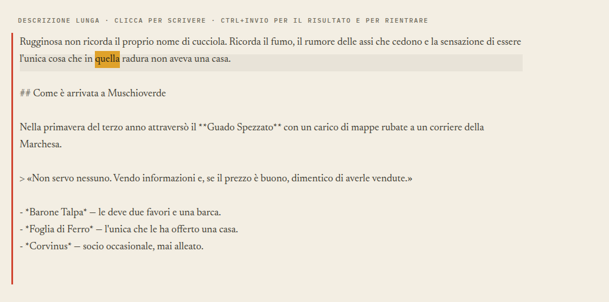
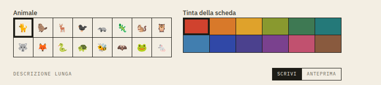
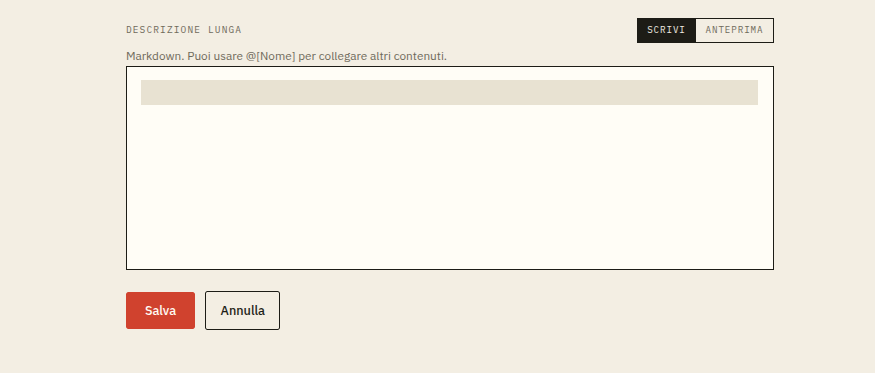
stessa cosa per nuovi npc
anche il nuovo luogo ha gli stessi problemi.
O mio dio anche la nuova sessione è orribile, è più da pensare come un documento.
Anche la nuova storia, questa è di sicuro un documento.
